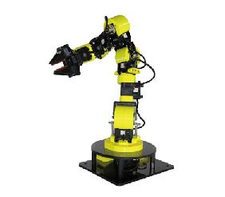

Cute Robot
======



This repository provides ROS support for the Cute Robot. The recommend operating environment is on Ubuntu 16.04 with ROS Kinetic or Ubuntu 14.04 with ROS Indigo. So far These packages haven't been tested in other environment.

### Installation

#### Ubuntu16.04 + ROS Kinetic

**Install some important dependent software packages:**
```sh
$ sudo apt-get install ros-kinetic-dynamixel-motor ros-kinetic-gazebo-ros-control ros-kinetic-ros-control ros-kinetic-ros-controllers
```
**Install or upgrade MoveIt!.**

If you have installed MoveIt!, please make sure that it's been upgraded to the latest version.

Install/Upgrade  MoveIt!:

```sh
$ sudo apt-get update
$ sudo apt-get install ros-kinetic-moveit
```

**Install this repository from Source**

First set up a catkin workspace (see [this tutorials](http://wiki.ros.org/catkin/Tutorials)).  
Then clone the repository into the src/ folder. It should look like /path/to/your/catkin_workspace/src/cute_robot.  
Make sure to source the correct setup file according to your workspace hierarchy, then use catkin_make to compile.  

Assuming your catkin workspace folder is ~/catkin_ws, you should use the following commands:
```sh
$ cd ~/catkin_ws/src
$ git clone -b kinetic-devel https://github.com/hans-robot/cute_robot.git
$ cd ..
$ catkin_make
$ source devel/setup.bash
```

#### Ubuntu14.04 + ROS Indigo

**Install some important dependent software packages:**
```sh
$ sudo apt-get install ros-indigo-dynamixel-motor ros-indigo-gazebo-ros-control ros-indigo-ros-control ros-indigo-ros-controllers
```
**Install or upgrade MoveIt!.**

If you have installed MoveIt!, please make sure that it's been upgraded to the latest version.

Install/Upgrade  MoveIt!:

```sh
$ sudo apt-get update
$ sudo apt-get install ros-indigo-moveit
$ sudo apt-get install ros-indigo-moveit-full-pr2
$ sudo apt-get install ros-indigo-moveit-kinematics
$ sudo apt-get install ros-indigo-moveit-ros-move-group
```

**Install this repository from Source**

First set up a catkin workspace (see [this tutorials](http://wiki.ros.org/catkin/Tutorials)).  
Then clone the repository into the src/ folder. It should look like /path/to/your/catkin_workspace/src/cute_robot.  
Make sure to source the correct setup file according to your workspace hierarchy, then use catkin_make to compile.  

Assuming your catkin workspace folder is ~/catkin_ws, you should use the following commands:
```sh
$ cd ~/catkin_ws/src
$ git clone -b indigo-devel https://github.com/hans-robot/cute_robot.git
$ cd ..
$ catkin_make
$ source devel/setup.bash
```

---

### Usage with Gazebo Simulation

Bring up the simulated robot in Gazebo:
```sh
$ roslaunch cute_model gazebo.launch
```
Start up RViz with a configuration including the MoveIt! Motion Planning plugin:
```sh
$ roslaunch cute_moveit_config moveit_planning_execution.launch
```
> Tutorial about how to use MoveIt! RViz plugin: [docs/moveit_plugin_tutorial_english.md](docs/moveit_plugin_tutorial_english.md)  
Tips:
Every time you want to plan a trajectory, you should set the start state to current first.

For the teleoperation with keyboard, run:
```sh
$ rosrun cute_teleop cute_teleop_keyboard
```
For the teleoperation with joystick, run:
```sh
$ roslaunch cute_moveit_config joystick_control.launch
```
> Tutorial about joystick control teleoperation:  
http://docs.ros.org/indigo/api/moveit_tutorials/html/doc/ros_visualization/joystick.html  
Tips:  
> 1. In the Motion Planning plugin of Rviz, enable “Allow External Comm.” checkbox in the “Planning” tab.  
> 2. Add “Pose” to rviz Displays and subscribe to /joy_pose in order to see the output from joystick. Note that only planning groups that have IK solvers for all their End Effector parent groups will work.

For more information about API, see [docs/API_description_english.md](docs/API_description_english.md)

---

### Usage with real Hardware
Connect Cute to the computer with a usb cable. You can see the usb device ID(s) with the following command.
```sh
$ ls /dev/ttyUSB*
```
If there are more than one usb devices, you should confirm the ID(s) of the other device(s) before you connect Cute to the computer. In this case you can find out the device ID of Cute. The default ID is /dev/ttyUSB0. If your device ID is not /dev/ttyUSB0, you should correct the following line in the file *cute_bringup/launch/cute_bringup.launch* 
```
        port_name: "/dev/ttyUSB0"
```
Correct the following lines in launch files according to the servo version.  
*cute_bringup/launch/cute_bringup.launch:*
```xml
    <!-- There are 3 options for servo: dynamixel, xqtor_0, xqtor_1 -->
    <!-- xqtor_0: the early version of the xQtor servo before 2017-->
    <!-- xqtor_1: the new version of the xQtor servo -->
    <arg name="servo" default="xqtor_1"/>
```

Assuming the device ID is /dev/ttyUSB0, bring up the real robot:
```sh
$ sudo chmod 777 /dev/ttyUSB0
$ roslaunch cute_bringup cute_bringup.launch
```

Make the robot go to home position:
```sh
$ rosservice call /cute_go_home "data: true"
or
$ rosservice call /cute_go_home "data: false"
# for this command "data: false" and "data: true" are the same
```

Start up RViz with a configuration including the MoveIt! Motion Planning plugin:
```sh
$ roslaunch cute_moveit_config moveit_planning_execution.launch
```
> Tutorial about how to use MoveIt! RViz plugin: [docs/moveit_plugin_tutorial_english.md](docs/moveit_plugin_tutorial_english.md)  
Tips:
Every time you want to plan a trajectory, you should set the start state to current first.

If you don't want to start up RViz at the moment, just run:
```sh
$ roslaunch cute_moveit_config moveit_planning_execution.launch display:=false
```

For the teleoperation with keyboard, run:
```sh
$ rosrun cute_teleop cute_teleop_keyboard
```
For the teleoperation with joystick, run:
```sh
$ roslaunch cute_moveit_config joystick_control.launch
```
> Tutorial about joystick control teleoperation:  
http://docs.ros.org/indigo/api/moveit_tutorials/html/doc/ros_visualization/joystick.html  
Tips:  
> 1. In the Motion Planning plugin of Rviz, enable “Allow External Comm.” checkbox in the “Planning” tab.  
> 2. Add “Pose” to rviz Displays and subscribe to /joy_pose in order to see the output from joystick. Note that only planning groups that have IK solvers for all their End Effector parent groups will work.

Before turning the robot off, you can use the following command to set torque disenable. At this time you should protect the robot from falling down.
```sh
$ rosservice call /cute_torque_enable "data: false" 
# "data: false" : disenable
# "data: true": enable 
```

You should set the gripper torque enabled before controlling it.
```sh
$ rosservice call /claw_controller/torque_enable "torque_enable: true"
``` 

For more information about API, see [docs/API_description_english.md](docs/API_description_english.md)

